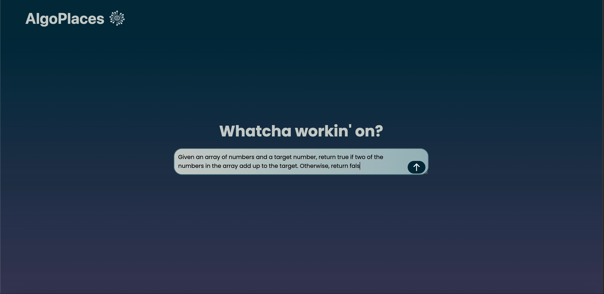

# AlgoPlaces 🧠

**Your AI-Powered Algorithm Learning Companion**

AlgoPlaces is an intelligent web application designed to help students and developers master algorithmic problem-solving through personalized strategies, practice problems, and interview preparation. Built with modern web technologies and powered by OpenAI's GPT models, it provides tailored learning experiences for coding interviews and algorithmic challenges.

## 🌟 Features

- **AI-Powered Strategy Generation**: Get personalized, step-by-step strategies for any algorithmic problem
- **Practice Problem Recommendations**: Receive curated practice problems based on your queries
- **Interview Probability Assessment**: Understand the likelihood of problems appearing in technical interviews
- **Progress Tracking**: Monitor your learning journey with persistent history
- **Google OAuth Integration**: Secure authentication with Google accounts
- **Responsive Design**: Beautiful, modern UI built with Tailwind CSS
- **Real-time Feedback**: Instant AI-generated responses and recommendations

## 🎬 Demo

## App Overview & AI Strategy Generation



## Practice Problems & History


## 🚀 Tech Stack

### Frontend

- **React 18** - Modern React with hooks
- **React Router** - Client-side routing
- **Tailwind CSS** - Utility-first CSS framework
- **Webpack** - Module bundler and dev server
- **Google OAuth** - Authentication

### Backend

- **Node.js** - JavaScript runtime
- **Express.js** - Web application framework
- **MongoDB** - NoSQL database with Mongoose ODM
- **OpenAI API** - AI-powered content generation
- **JWT** - JSON Web Token authentication
- **CORS** - Cross-origin resource sharing

### Development Tools

- **Webpack Dev Server** - Development server with hot reload
- **Nodemon** - Auto-restart server during development
- **PostCSS** - CSS processing
- **Babel** - JavaScript transpilation

## 📋 Prerequisites

Before running this application, make sure you have the following installed:

- **Node.js** (v14 or higher)
- **npm** (v6 or higher)
- **MongoDB** account (or local MongoDB installation)
- **OpenAI API Key**
- **Google OAuth Credentials**

## 🛠️ Installation & Setup

### 1. Clone the Repository

```bash
git clone https://github.com/JoshuaHirakawa/AlgoPlaces.git
cd AlgoPlaces
```

### 2. Install Dependencies

```bash
npm install
```

### 3. Environment Variables

Create a `.env` file in the root directory and add the following variables:

```env
OPENAI_API_KEY=your_openai_api_key_here
MONGODB_URI=your_mongodb_connection_string_here
JWT_SECRET=your_jwt_secret_here
```

### 4. Database Setup

Make sure your MongoDB database is running and accessible. The application will automatically connect using the provided `MONGODB_URI`.

## 🏃‍♂️ Running the Application

### 🚀 Quick Start (Recommended)

Run both frontend and backend servers simultaneously with a single command:

```bash
npm run dev:colored
```

This will start:

- **Backend Server**: `http://localhost:3000` (Express API)
- **Frontend Server**: `http://localhost:8080` (React App)

### Alternative Development Options

**Option 1 - Simple Concurrent:**

```bash
npm run dev:full
```

**Option 2 - Separate Terminals:**

**Terminal 1 - Backend Server:**

```bash
npm run server
```

**Terminal 2 - Frontend Server:**

```bash
npm run client
```

### Production Build

```bash
npm run build
```

## 🌐 Usage

### Quick Start Guide

1. **Authentication**: Visit `http://localhost:8080` and sign in with your Google account
2. **Submit a Problem**: Enter any algorithmic problem or coding challenge
3. **Get AI Strategy**: Receive a personalized strategy with step-by-step guidance
4. **Practice Problems**: Get recommended practice problems based on your query
5. **Track Progress**: View your history and track your learning journey
6. **Interview Prep**: See interview probability ratings for different problem types

## 📁 Project Structure

```
AlgoPlaces/
├── src/                          # Frontend source code
│   ├── components/               # React components
│   │   ├── App.js               # Main app component
│   │   ├── Dashboard.js         # Main dashboard
│   │   ├── LoginPage.js         # Authentication page
│   │   ├── Strategy.js          # Strategy display component
│   │   ├── PracticeProblem.js   # Practice problems component
│   │   ├── History.js           # User history component
│   │   └── InputProblem.js      # Problem input component
│   ├── assets/                  # Static assets
│   │   └── images/             # Image files
│   ├── styles/                  # CSS files
│   └── index.js                # Entry point
├── server/                      # Backend source code
│   ├── controllers/            # Route controllers
│   │   ├── openaiController.js # OpenAI API integration
│   │   ├── historyController.js # User history management
│   │   └── parseUserQuery.js   # Query processing
│   ├── models/                 # Database models
│   │   └── userProgressModel.js # User progress schema
│   ├── routes/                 # API routes
│   │   └── apiRoutes.js        # Main API routes
│   └── server.js               # Express server
├── webpack.config.js           # Webpack configuration
├── tailwind.config.js          # Tailwind CSS configuration
├── package.json                # Project dependencies
└── README.md                   # Project documentation
```

## 🔧 API Endpoints

- `POST /api/strategy` - Generate AI strategy for a given problem
- `GET /api/history` - Retrieve user's problem-solving history
- `POST /api/history` - Save new problem-solving session
- `PUT /api/history` - Update existing history entry

## 🤝 Contributing

We welcome contributions! Please follow these steps:

1. Fork the repository
2. Create a feature branch (`git checkout -b feature/AmazingFeature`)
3. Commit your changes (`git commit -m 'Add some AmazingFeature'`)
4. Push to the branch (`git push origin feature/AmazingFeature`)
5. Open a Pull Request

## 📝 License

This project is licensed under the MIT License - see the [LICENSE](LICENSE) file for details.

## 👥 Team

- **Joshua Hirakawa** - Project Lead & Full-Stack Developer
- **Aditi Srivastava** - Full-Stack Developer
- **Amrita Bahadur** - Full-Stack Developer
- **Winston Ludlam** - Full-Stack Developer

## 🙏 Acknowledgments

- OpenAI for providing the GPT API
- Google for OAuth integration
- MongoDB for database services
- The React and Node.js communities for excellent documentation

## 📞 Support

If you encounter any issues or have questions, please:

1. Check the existing issues on GitHub
2. Create a new issue with detailed information
3. Contact the development team

---

**Happy Coding! 🚀**


